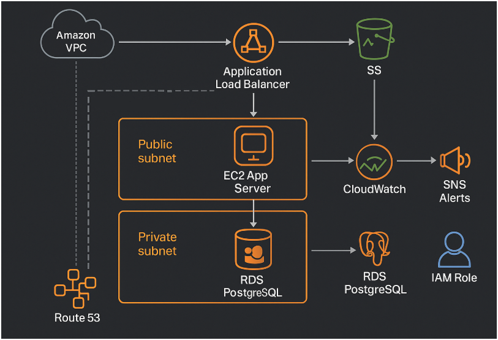

# AWS Infrastructure Migration with Zero Downtime (Automation Case Study)


---

## 📘 Project Overview
This project demonstrates how to migrate a legacy on-premise application to a modern, scalable AWS infrastructure with **zero downtime**.  
It showcases infrastructure automation, database migration, monitoring, and cost optimization—key skills for a Senior DevOps Engineer.

---

## 🏗️ Architecture Overview
**Components included:**
- **VPC (10.0.0.0/16)** with isolated public and private subnets  
- **Application Load Balancer (ALB)** for traffic routing  
- **EC2 App Server** running on Ubuntu (in private subnet)  
- **RDS PostgreSQL** instance for persistent storage  
- **S3** for static files and database backups  
- **CloudWatch + SNS** for metrics and alerts  
- **IAM Roles** with least-privilege access  
- **Route 53** for DNS routing

🖼️ *Architecture Diagram:*  


---

## ⚙️ Technologies Used
| Category | Tools / Services |
|-----------|------------------|
| Cloud Provider | AWS |
| IaC | Terraform |
| Scripting | Python (boto3) |
| Database | RDS PostgreSQL |
| Monitoring | CloudWatch, SNS |
| OS | Linux (Ubuntu 22.04) |

---

## 🚀 Deployment Steps
1. **Clone this repo**  
   ```bash
   git clone https://github.com/yourusername/aws-infra-migration-automation.git
   cd aws-infra-migration-automation/terraform


aws configure


terraform init
terraform plan
terraform apply


python3 ../scripts/db_backup.py

